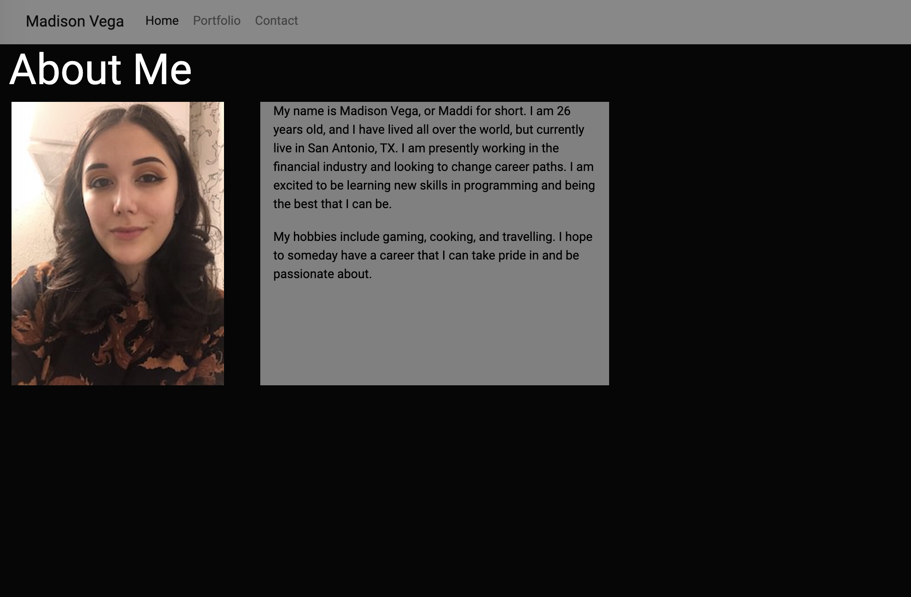
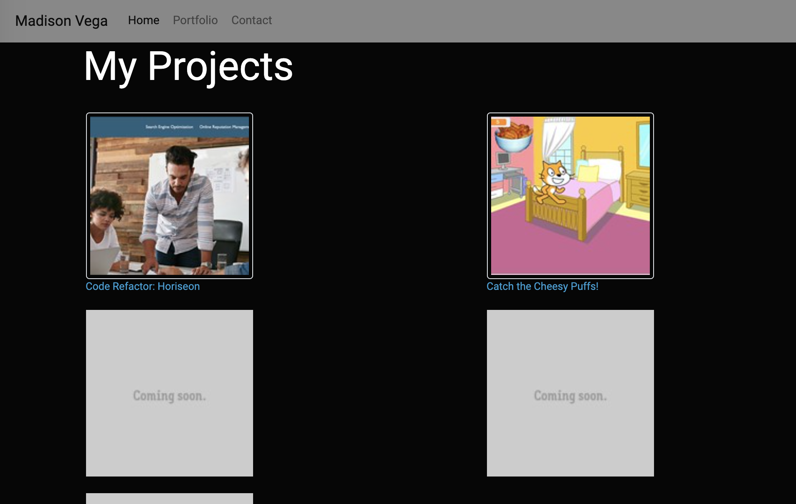
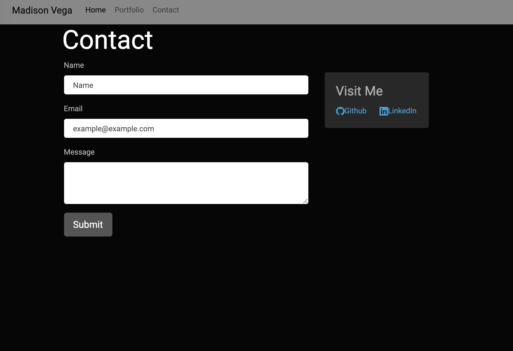

# HW2-My-Portfolio

# Description

This is my Responsive Portfolio.  As a novice level programmer it is important to build a responsive portfolio to ensure maximum readability.  It is also beneficial practice my newly learned skills in designing responsive content utilizing Bootstrap.

## Usage

On the live website you can click on the navigation links to cycle through the different pages of my portfolio.  I have an About Me section, a page with my projects, and a Contact page.  

## Links

## Credits

## License